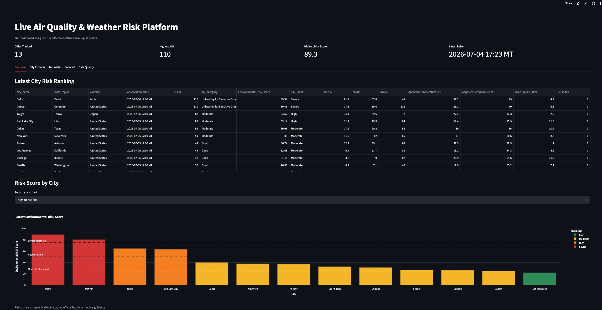
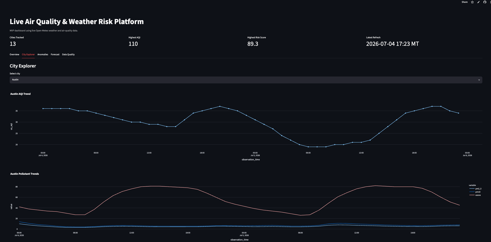
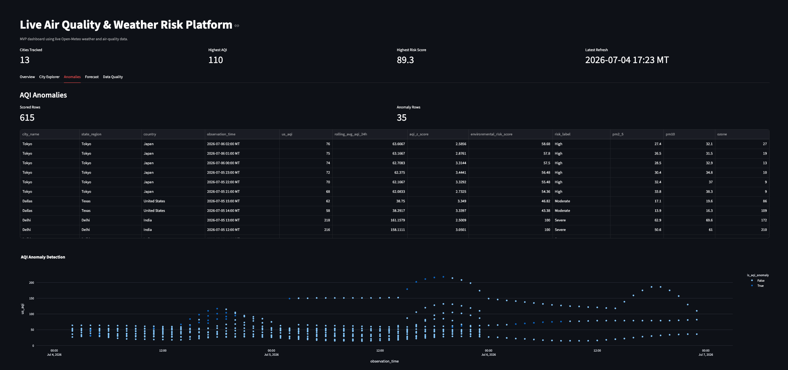
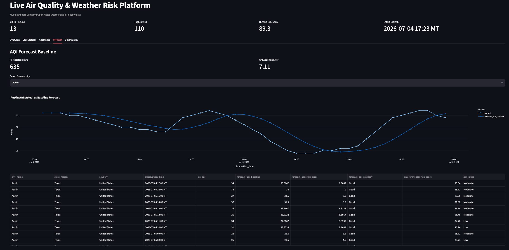
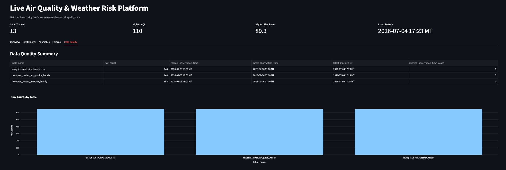

# Live Air Quality & Weather Risk Platform

An end-to-end live data platform that ingests weather and air-quality data, stores raw and modeled data in PostgreSQL, calculates city-level environmental risk, and serves a dashboard in Streamlit.

## Live App

Streamlit app: https://live-air-risk-platform-937cvdm2bh5sfqcaejhnoq.streamlit.app/

## Current MVP Status

Working:
- Python 3.12 virtual environment
- Neon PostgreSQL database
- Raw weather and air-quality tables
- City seed table with 13 cities
- Open-Meteo weather ingestion
- Open-Meteo air-quality ingestion
- API request logging
- Retry handling for API timeout failures
- dbt staging models
- dbt risk marts
- BI-ready marts for Power BI, Tableau, and Looker
- Data quality summary mart
- Streamlit dashboard
- GitHub Actions scheduled ingestion every 3 hours

## Dashboard Screenshots

### Overview



### City Explorer



### Anomalies



### Forecast



### Data Quality



## Stack

Python 3.12, PostgreSQL/Neon, dbt Core, dbt-postgres, Streamlit, Plotly, pandas, psycopg2, GitHub Actions, Open-Meteo Weather API, Open-Meteo Air Quality API.

## Architecture

Open-Meteo APIs are ingested with Python scripts into raw PostgreSQL tables. dbt transforms the raw data into staging views, risk marts, BI-ready marts, and data quality summary tables. Streamlit reads from the analytics marts to display city-level environmental risk, AQI trends, pollutant trends, weather context, and data freshness.

## Database Tables

Raw schema:
- raw.api_requests
- raw.open_meteo_weather_hourly
- raw.open_meteo_air_quality_hourly

Analytics schema:
- analytics.cities
- analytics.stg_cities
- analytics.stg_weather_hourly
- analytics.stg_air_quality_hourly
- analytics.mart_city_hourly_risk
- analytics.mart_latest_city_risk
- analytics.mart_bi_city_risk_summary
- analytics.mart_bi_hourly_city_trends
- analytics.mart_data_quality_summary

## Local Setup

Create and activate a virtual environment:

    python3.12 -m venv .venv
    source .venv/bin/activate

Install dependencies:

    python -m pip install --upgrade pip
    python -m pip install -r requirements.txt

Create a .env file:

    cp .env.example .env

Add your Neon connection string:

    DATABASE_URL=your_neon_postgres_connection_string

## Run Database Setup

    python db/setup_db.py

## Run Ingestion Locally

    python -m ingestion.run_pipeline

## Run dbt

    cd dbt/air_risk
    dbt debug --profiles-dir .
    dbt run --profiles-dir .
    dbt test --profiles-dir .
    cd ../..

## Run Streamlit Dashboard

    streamlit run app/streamlit_app.py

## Scheduling

GitHub Actions runs the ingestion and dbt pipeline every 3 hours.

Required GitHub repository secret:

    DATABASE_URL

## Dashboard Notes

The Streamlit dashboard displays timestamps in Mountain Time with an MT suffix. Database timestamps are stored as raw timestamps from ingestion/modeling, while dashboard display is formatted for readability.

## Risk Score Disclaimer

The environmental risk score is an analytical indicator. It is not official health, medical, or emergency guidance.

## BI Dashboard Plan

Power BI, Tableau, or Looker can connect directly to the BI-ready marts:
- analytics.mart_bi_city_risk_summary
- analytics.mart_bi_hourly_city_trends

These tables are designed for city ranking, AQI trend analysis, pollutant comparison, weather context, and risk segmentation.

## What This Project Demonstrates

This project is a live environmental risk analytics platform built around a production-style data workflow:

- Scheduled API ingestion from live weather, air-quality, and NOAA/NWS alert sources
- Raw API response storage for lineage and debugging
- Normalized raw tables for queryable hourly observations
- dbt staging and mart models for analytics-ready outputs
- City-level risk scoring, anomaly detection, and AQI forecast baselines
- Data quality and freshness monitoring
- Deployed Streamlit dashboard connected to modeled PostgreSQL tables
- BI-ready marts that can also support Power BI, Tableau, or Looker

## Metric and Semantic Layer

The modeled analytics layer is designed around reusable city-level metrics rather than one-off dashboard calculations.

Core metrics include:

| Metric | Definition | Source Model |
|---|---|---|
| Latest AQI | Most recent available US AQI value for each city | `mart_latest_city_risk` |
| Risk Score | Composite 0-100 environmental risk indicator using AQI and weather modifiers | `mart_city_hourly_risk` |
| Risk Category | Human-readable risk band derived from the risk score | `mart_city_hourly_risk` |
| AQI Anomaly Flag | Identifies unusual AQI spikes compared with recent rolling patterns | `mart_aqi_anomalies` |
| Forecast AQI | Short-term AQI baseline forecast for monitored cities | `mart_aqi_forecast_baseline` |
| Data Freshness | Measures whether city-level data has updated recently | `mart_data_quality_summary` |
| Active Weather Alerts | Count of currently active NOAA/NWS alerts by city | `mart_city_weather_alerts` |
| Highest Alert Severity | Highest active NOAA/NWS alert severity for each city | `mart_city_weather_alerts` |

## Architecture

```text
Open-Meteo Weather API
Open-Meteo Air Quality API
NOAA/NWS Weather Alerts API
        |
        v
Python ingestion layer
        |
        v
Neon PostgreSQL
- raw schema
- analytics schema
        |
        v
dbt Core
- staging views
- analytics marts
- BI-ready marts
- data quality models
        |
        v
Streamlit dashboard
        |
        v
Optional BI layer
- Power BI
- Tableau
- Looker
```

## Phase 2: NOAA/NWS Weather Alert Enrichment

The platform now enriches city-level environmental risk monitoring with active NOAA/NWS weather alerts for US cities.

The alert pipeline:

- Pulls active weather alerts from the NOAA/NWS API
- Filters ingestion to tracked US cities
- Stores alert details in PostgreSQL
- Models city-level alert summaries in dbt
- Surfaces alert counts, severity, and latest alert details in Streamlit

This adds a real weather-risk dimension beyond AQI and pollutant monitoring.

## Architecture Diagram

The project architecture is documented in [`docs/architecture.md`](docs/architecture.md).
