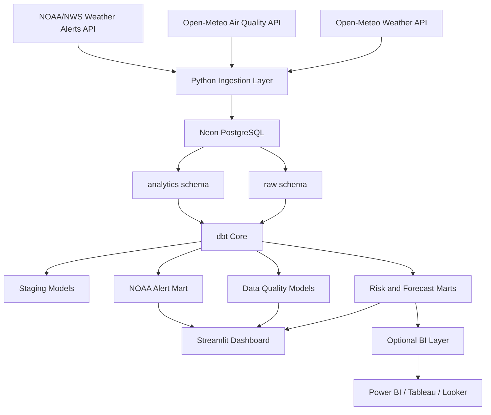

# Architecture Diagram

```mermaid
flowchart TD
    A[Open-Meteo Weather API] --> D[Python Ingestion Layer]
    B[Open-Meteo Air Quality API] --> D
    C[NOAA/NWS Weather Alerts API] --> D
    D --> E[Neon PostgreSQL]
    E --> F[raw schema]
    E --> G[analytics schema]
    F --> H[dbt Core]
    G --> H
    H --> I[Staging Models]
    H --> J[Risk and Forecast Marts]
    H --> K[Data Quality Models]
    H --> L[NOAA Alert Mart]
    J --> M[Streamlit Dashboard]
    K --> M
    L --> M
    J --> N[Optional BI Layer]
    N --> O[Power BI / Tableau / Looker]
```
